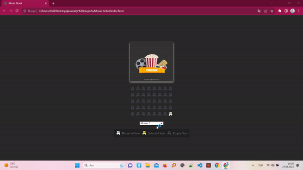

<h2>The name of the project</h2>

# JavaScript-Movie_Ticket_Project

<h3>The aim of the project</h3>

Itry to create a project for movie seat reservation. I aim to write clear and applicable code.

<h3>The technologies-tools used for this project</h3>

Html-Css and Javascript 

<h4>The scrren of the project</h4>

